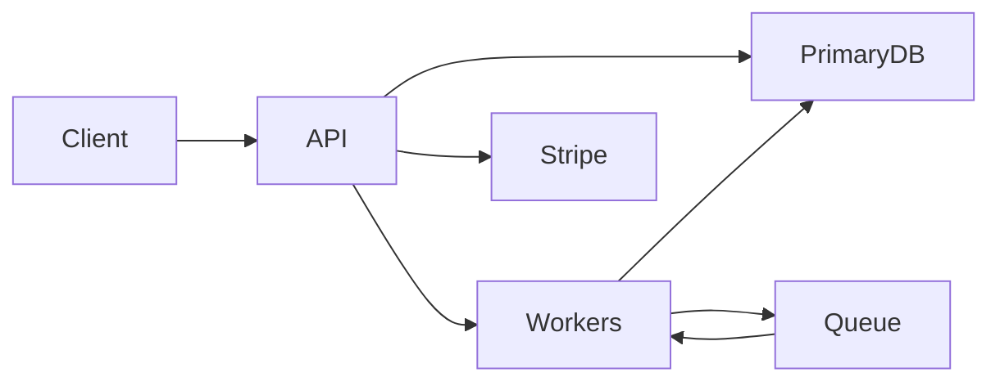

# Architecture Review Reference

Checklists for `/architecture-review`. Use what applies; skip the rest.

## A. Codebase / module architecture

### Depth and size

- [ ] Public surface small relative to implementation (deep module)
- [ ] Files >~500–800 lines with many concerns flagged for split
- [ ] Fan-out hubs (importing 10+ unrelated modules) justified or split
- [ ] “Utils/common/helpers” not a junk drawer of unrelated policies

### Seams and layers

- [ ] Domain / product rules do not import HTTP, Stripe SDK, ORM details directly (or adapters isolate them)
- [ ] Presentation (bot, web, email) consumes product helpers — does not invent prices/plans
- [ ] Payments map provider IDs → plan keys; do not own marketing copy
- [ ] Config/secrets/tunables separated from product packaging
- [ ] Hypothetical seam (one adapter) vs real seam (two+ implementations) called out honestly

### Coupling and change

- [ ] Callers depend on stable helpers/APIs, not each other’s literals
- [ ] Feature flags and entitlements centralized
- [ ] Hard-to-test core? Missing seam or too many concrete deps
- [ ] Stability promises (iterator identity, global singletons, leaked types) that freeze bad internals

### API shape (in-process or library)

- [ ] Bulk/batch ops where loops cross expensive boundaries
- [ ] Views/spans instead of forced ownership transfer
- [ ] Error model doesn’t force heavy allocations on success paths (when hot)

### Product-fact hygiene

**Required:** read and apply `~/.agents/skills/software-design-principles/SKILL.md` on every architecture review (DRY, SoT, SoC). Emit findings as Area `design` in the main report table — not a separate optional note.

---

## B. Distributed system design

### Do you need multiple services?

Prefer a modular monolith unless you need independent scale, failure isolation, or team deploy autonomy. Flag premature splits and also flag monoliths that are already distributed in practice (many writers, shared DB, no ownership).

### Boundaries

- [ ] Each service owns a **bounded context** and its primary data
- [ ] Cuts align with change rate / team / consistency needs — not with folder names
- [ ] No “distributed monolith”: sync mesh + shared tables + coupled deploys
- [ ] Shared libraries don’t become a backdoor coupling channel for domain logic

### Data ownership

- [ ] **Single writer** per authoritative entity (or explicit multi-leader with conflict rules)
- [ ] No dual writes to two stores without outbox / transaction / saga ownership
- [ ] Read models / caches have clear invalidation or rebuild story
- [ ] Cross-service joins avoided on the write path; compose at read or via events

### Consistency

For each critical flow, state the model:

| Model | Typical use |
|-------|-------------|
| Strong / single-primary | Payments capture, inventory decrement, identity |
| Read-your-writes | User just updated profile / settings |
| Eventual | Feeds, analytics, search indexes |
| Causal / ordering | Workflows where A-before-B matters |

- [ ] Clients never guess; APIs/docs imply the guarantee
- [ ] Conflict resolution defined for concurrent updates
- [ ] “Sync later” jobs have idempotency + observable lag

### Communication

- [ ] Sync RPC for request/response that must succeed together (with tight budgets)
- [ ] Async messaging for side effects, fan-out, and temporal decoupling
- [ ] Avoid deep sync chains on the user request path (amplifies latency & failure)
- [ ] Contracts versioned; consumers tolerant; producers careful

### Failure and retries

- [ ] Every outbound call: timeout, retry budget, backoff, cancellation
- [ ] Retries are **safe** (idempotency keys, dedupe, exactly-once *effect* even if at-least-once delivery)
- [ ] Poison messages → DLQ / quarantine, not infinite retry
- [ ] Partial outage behavior: fail closed vs open decided per feature (auth vs recommendations)
- [ ] No retry storms: jitter, bulkheads, circuit breakers where needed

### Load and backpressure

- [ ] Queues have max depth / age alerts; producers slow down or shed
- [ ] Hot keys / partitions understood for stateful stores
- [ ] Rate limits at edges; load shedding before meltdown
- [ ] Fan-out N+1 remote calls eliminated or bounded

### Latency and capacity (back of envelope)

- [ ] Critical path latency budget allocated across hops
- [ ] Amplification known (1 user action → K downstream calls)
- [ ] Rough RPS × cost per op vs provisioned capacity
- [ ] Use order-of-magnitude costs (memory ns vs DC RTT vs cross-region) — see performance-tuning reference for the ns table; here focus on **network hops and storage ops**

### Operability

- [ ] SLIs/SLOs for critical journeys
- [ ] Trace context across services; correlation IDs on async messages
- [ ] Dashboards + alerts for error rate, latency, queue lag, saturation
- [ ] Deploy/rollback independence matches the service cut
- [ ] Runbook for: dependency down, poison message, dual-write drift, cache stampede

### Security / tenancy (when relevant)

- [ ] Authn/z at the right boundary; service-to-service identity
- [ ] Tenant isolation for data and noisy neighbors
- [ ] Secrets not in product modules; least privilege to stores

---

## C. Ranking cheat sheet

Ask in order:

1. Who owns the **authoritative write**?
2. What happens when **this hop fails** mid-flight?
3. Can two writers **disagree**, and who wins?
4. Is this boundary buying **isolation** or just **indirection**?
5. Can a new teammate (or agent) change one side **without hunting literals/policies**?

---

## D. Report snippets (optional)

**Mermaid — context map**

**Finding style**

> **high / failure** — Stripe webhook → entitlement grant has no idempotency key; retries can double-grant. Fix: upsert by `event.id`, single writer in entitlements service/module.
